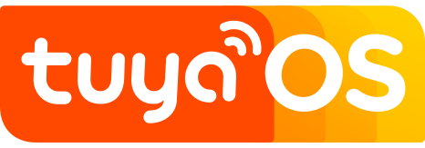

## About Tuya: IoT made easy

Tuya IoT Development Platform is a global platform that builds IoT development and interconnectivity standards to bridge the needs of brand owners, OEMs, retail chains, and more partners on the journey of smart development. The platform empowers global developers to drive IoT innovation.

**Bring your ideas to life with us.**

## Explore More

* 🏡Find our homepage at  [tuya.com](https://tuya.com). Check out our developer resources at [Tuya IoT Development Platform](https://iot.tuya.com/), [Solution Center](https://solution.tuya.com/), [Tuya Developer](https://developer.tuya.com/en), and [Documentation](https://developer.tuya.com/docs). Join our developer community at [tuyaos.com](https://tuyaos.com) to go far and go together.
* [🔋IoT Core](https://developer.tuya.com/en/iot-core): Enable efficient and secure connection between smart devices and the cloud, and streamline registration, monitoring, and management of interconnected devices.
* [☁️Cube Private Cloud](https://www.tuya.com/solution/cube): Build a secure and reliable private IoT platform easily by leveraging Tuya's resourceful smart product ecosystem.
* [🚀TuyaOS](https://developer.tuya.com/en/tuyaos): Benefit from the distributed platform-agnostic IoT operating system that enables quick integration of smart devices into the Tuya IoT Cloud.
* [🧩Smart MiniApp](https://developer.tuya.com/miniapp/): Develop, test, deploy, and manage user-friendly multi-platform MiniApp from a single codebase, in a way like building web apps.